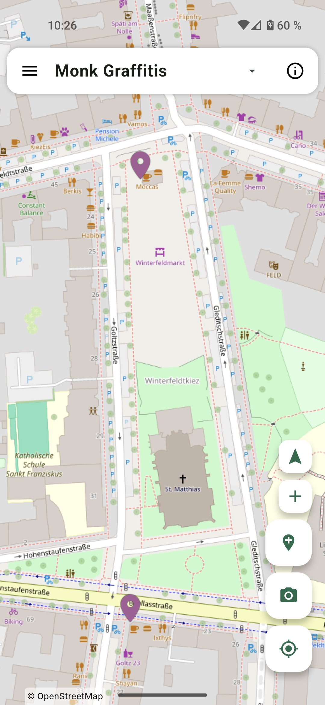
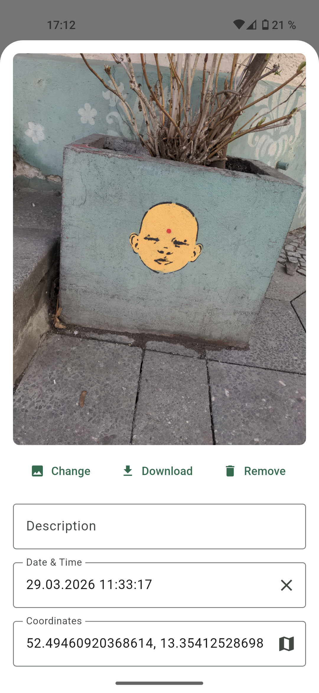
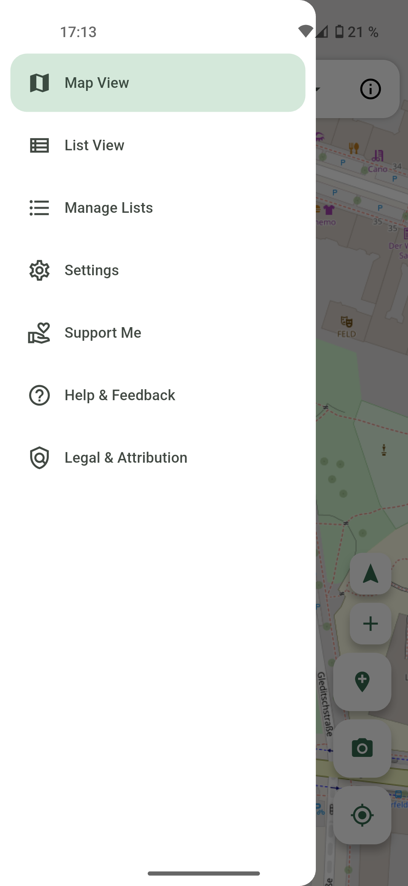

# Pinpoint - Personal Mapping

A free and open-source cross-platform but primarily mobile app to map things/points of interest in your surroundings and around the globe. It lets you mark different locations on a map and add metadata to each entry in the form of text, an image and a timestamps. You can organize the entries in different lists.

One day you might even be able to share and collaborate on lists.

## Downloads

There are two different flavors of the app. There is the default version that uses Googles proprietary Location Manager for an improved location accuracy in the background and a fully FOSS (Free and Open Source) version that uses the native pure GPS location service. 

Both the App Store (iOS) and Play Store (Android) ship the default version. F-Droid (Android) ships the FOSS version.

You can find all versions under the [lastest release](https://github.com/StrangeGirlMurph/Pinpoint/releases/latest)

## Screenshots

A few screenshots of the app. View all screenshots [here](assets/screenshots/).

|                   Map view                   |                     Bottom sheet                     |               Drawer/Pages               |
| :------------------------------------------: | :--------------------------------------------------: | :--------------------------------------: |
|  |  |  |

## Use cases and backstory

This app is a hobby project of a student from Berlin who has an autistic special interest in the amazing local graffiti art scene (aka me). I love spotting and collecting graffitis from different collectives in my everyday life. I also love data and started remembering and mapping out all the different spots where I discovered the graffitis of my favorite artists. But my head only has limited capacity. Thus came the idea for a digital solution that would let me easily map different locations in multiple lists (each for a given artist/collective) and add a picture and some other comments to each entry. I wasn't happy with Google Earths capabilities and couldn't find a better or any alternative really that ticks all my boxes. May this app allow everyone to easily map out their environment. Whether it's birds, art, nice park benches or whatever!

## Privacy Policy

This app respects your privacy. All your data, including markers, images, and lists, is stored strictly locally on your device.

No personal data is collected, no telemetry is used, and nothing is sent to the developer or any third parties. The internet connection required by this app is used exclusively for fetching map tiles from the OpenStreetMap Foundations servers.

The location permission is used to add entries at your current location and the camera permission is used to add pictures to your entries.

## Accessibility 

Sadly this app isn't accessible to screenreaders. The main feature of the app is the map view and I don't know a good way to make that UI accessible.

## Technology

This app is made with [Flutter](https://flutter.dev). See [CONTRIBUTING](CONTRIBUTING.md) for some more details.

## License

This project is licensed under the GPLv3 (see [LICENSE](LICENSE)).
