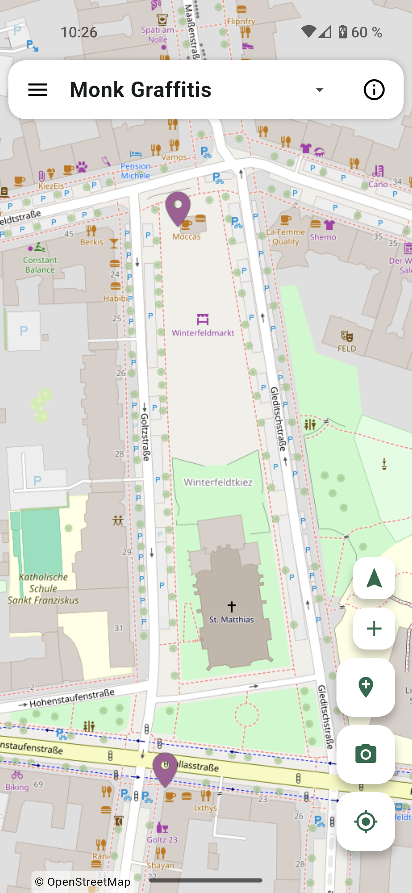
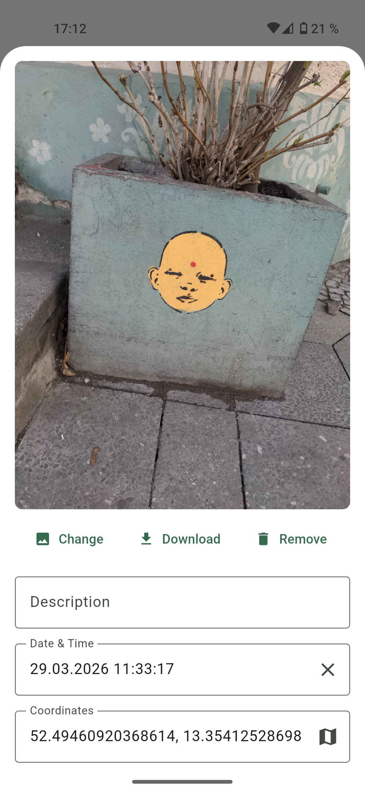
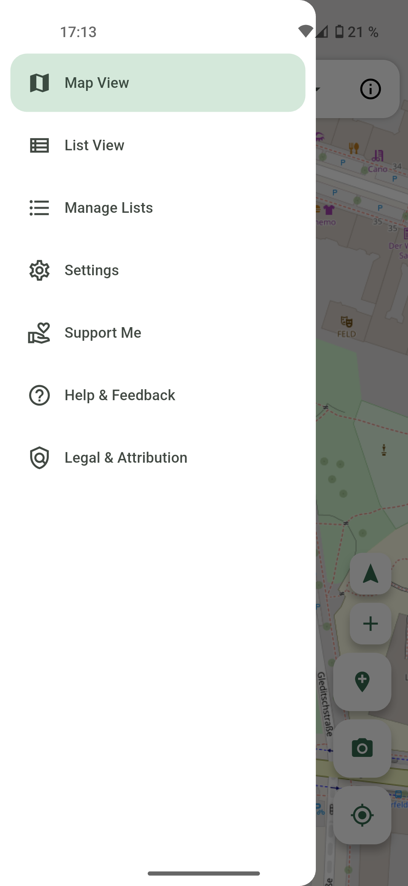

# Pinpoint - Personal Mapping

A free and open-source cross-platform mobile app to map things/points of interest in your surroundings and around the globe. It lets you mark different locations on a map and add metadata to each entry in the form of text, an image and a timestamps. You can organize the entries in different lists.

One day you might even be able to share and collaborate on lists.

## Download

Because Apple doesn't allow me to publish an app to iOS without sending them a copy of my ID and publishing the app over Googles Play Store requires the same this app is only available for install from the [F-Droid store](https://f-droid.org/) (soon!) and directly from the apk file. Both depend on Google keeping Android open which we sadly can't take for granted anymore. Please inform yourself on the matter under: [keepandroidopen.org](https://keepandroidopen.org/)

Note: There are two different flavors of the app. There is the version that uses Googles proprietary Location Manager for an improved location accuracy in the background and a fully FOSS (Free and Open Source Software) (or in this case rather: Fully Open Source Software) version that uses the native pure GPS location service. 

### From [F-Droid](https://f-droid.org/en/)

F-Droid ships the FOSS version of the app. You can simply download it there and let F-Droid take care of updates and everything.

### From the apk

To manually install the apk find the relevant version from the [lastest release](https://github.com/StrangeGirlMurph/Pinpoint/releases/latest) of the app, download it and then follow the pop ups asking you to allow your browser to install apps if you haven't granted those yet. For a more detailed guide with more infos follow [this](https://www.thecustomdroid.com/how-to-install-apk-on-android/) article for example. There are 6 different apk files. For three different chip types and then for the FOSS (marked with `-foss`) and non-FOSS versions each. The majority of Android phones use an `arm64-v8a` chip so if you don't know your chips architecture it's a good idea to just try that one.  

## Screenshots

A few screenshots of the app. View all screenshots [here](assets/screenshots/).

    
    
    

## Use cases and backstory

This app is a hobby project of a student from Berlin who has an autistic special interest in the amazing local graffiti art scene (aka me). I love spotting and collecting graffitis from different collectives in my everyday life. I also love data and started remembering and mapping out all the different spots where I discovered the graffitis of my favorite artists. But my head only has limited capacity. Thus came the idea for a digital solution that would let me easily map different locations in multiple lists (each for a given artist/collective) and add a picture and some other comments to each entry. I wasn't happy with Google Earths capabilities and couldn't find a better or any alternative really that ticks all my boxes. May this app allow everyone to easily map out their environment. Whether it's birds, art, nice park benches or whatever!

## Privacy Policy

This app respects your privacy. All your data, including markers, images, and lists, is stored strictly locally on your device.

No personal data is collected, no telemetry is used, and nothing is sent to the developer or any third parties. The internet connection required by this app is used exclusively for fetching map tiles from the OpenStreetMap Foundations servers.

The location permission is used to add entries at your current location and the camera permission is used to add pictures to your entries.

## Accessibility 

Sadly this app isn't accessible to screenreaders. The main feature of the app is the map view and I don't know a good way to make that UI accessible.

## Technology

This app is made with [Flutter](https://flutter.dev). The data is stored in a sqlite database. See [CONTRIBUTING](CONTRIBUTING.md) for some more details.

## License

This project is licensed under the GPLv3 (see [LICENSE](LICENSE)).
